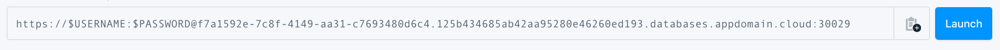

---
copyright:
  years: 2017, 2020
lastupdated: "2021-11-11"

keywords: rabbitmq, databases

subcollection: messages-for-rabbitmq

---

{:external: .external target="_blank"}
{:shortdesc: .shortdesc}
{:screen: .screen}
{:codeblock: .codeblock}
{:pre: .pre}
{:tip: .tip}


# Connecting with the RabbitMQ Management Plug-in
{: #rabbitmq-management-plugin}

{{site.data.keyword.messages-for-rabbitmq_full}} deployments have the RabbitMQ management plug-in enabled by default, which enables access to your RabbitMQ from a web browser, API, or from the command line. 

## RabbitMQ Management UI
{: #rabbitmq-management-ui}

From the _Connections_ pane of your deployment's _Dashboard Overview_, there is a button to open RabbitMQ Management UI.

{: caption="Figure 1. Link to open RabbitMQ Management UI" caption-side="bottom"}

The URL connection information is also in the "https" section of your [connection strings](/docs/messages-for-rabbitmq?topic=messages-for-rabbitmq-connection-strings). The web address for your RabbitMQ deployment is in the "composed" field of your connection strings.

Since {{site.data.keyword.messages-for-rabbitmq}} deployments are signed with a self-signed certificate, you might encounter a security warning when you first try to open the page. You can configure your system to trust the [provided self-signed certificate](/docs/messages-for-rabbitmq?topic=messages-for-rabbitmq-external-app#tls-and-self-signed-certificate-support). Review your browser's or your system's documentation on how to do this.

You are next asked to enter your username and password. After you have signed in, you can see an _Overview_ of your RabbitMQ deployment. 

You can use any user on your deployment to access the UI. Some features are only available to the admin user provisioned with your deployment.
{: .tip} 

General usage documentation can be found on the [RabbitMQ Management plug-in](https://www.rabbitmq.com/management.html) page.

### Connecting through private endpoints
{: #rabbitmq-private-endpoints}

{{site.data.keyword.messages-for-rabbitmq}} also offers both private and public cloud service endpoints. If you want to access the Management UI from a browser that is not on the private network, you must take these additional steps as listed in the [Connecting Through Private Endpoints](/docs/messages-for-rabbitmq?topic=cloud-databases-service-endpoints#private-endpoint-connections) documentation for {{site.data.keyword.cloud}} Databases.

After you have configured your environment for private endpoint access, you can navigate to the {{site.data.keyword.messages-for-rabbitmq}} management endpoint URL from your browser. For example, `https://bfdb-4263-8ad2-c9a4beaf4591.8f7bfc8f3faa4218afd56e0.databases.appdomain.cloud:323232`

## RabbitMQ Management HTTP API
{: #rabbitmq-management-http-api}

The Management plug-in also provides an [API](https://www.rabbitmq.com/management.html#http-api) for your RabbitMQ deployment. The base endpoint the same HTTP URL as the browser URL with `/api`. For example,
`https://1a619c43-6425-4abb-8df0-0c7b1b3a3001.8f7bfd8f3faa4218aec56e069eb46187.databases.appdomain.cloud:31797/api/`

The API uses `application/json` data and requires basic authentication. You can use any user that you created on your deployment to access the UI. However, some features might only be available to the admin user.

Documentation and examples are provided with your deployment at the browser URL with `/api/index.html`. For example,
`https://1a619c43-6425-4abb-8df0-0c7b1b3a3001.8f7bfd8f3faa4218aec56e069eb46187.databases.appdomain.cloud:31797/api/index.html`

## Installing `rabbitmqadmin`
{: #rabbitmq-install-rabbitmqadmin}

The `rabbitmqadmin` binary is available directly from your deployment. The download and installation instructions are found on `/cli` page of the management plug-in. For example,
`https://1a619c43-6425-4abb-8df0-0c7b1b3a3001.8f7bfd8f3faa4218aec56e069eb46187.databases.appdomain.cloud:31797/cli`

`rabbitmqadmin` is also available with a full, local installation of the RabbitMQ package. However, if the version of the package you download doesn't match the deployment's RabbitMQ version, it might not connect.
{: .tip}

## Connecting with `rabbitmqadmin`
{: #rabbitmq-connecting-rabbitmqadmin}

The `rabbitmqadmin` connection information is in the "cli" section of your [connection strings](/docs/messages-for-rabbitmq?topic=messages-for-rabbitmq-connection-strings). The table contains a breakdown for reference.

Field Name|Index|Description
----------|-----|-----------
`Bin`||The recommended binary to create a connection; in this case it is `rabbitmqadmin`.
`Composed`||A formatted command to establish a connection to your deployment. The command combines the `Bin` executable, `Environment` variable settings, and uses `Arguments` as command-line parameters.
`Environment`||A list of keys or values you set as environment variables.
`Arguments`|0...|The information that is passed as arguments to the command shown in the Bin field.
`Certificate`|Base64|A self-signed certificate that is used to confirm that an application is connecting to the appropriate server. It is base64 encoded.
`Certificate`|Name|The allocated name for the self-signed certificate.
`Type`||The type of package that uses this connection information; in this case `cli`. 
{: caption="Table 1. rabbitmqadmin/cli connection information" caption-side="top"}

* `0...` indicates that there might be one or more of these entries in an array.

The example command lists all the exchanges in your RabbitMQ.

```shell
rabbitmqadmin --username=admin --password=$PASSWORD --ssl --ssl-ca-cert-file=0b22f14b-7ba2-11e8-b8e9-568642342d40 --host=1a619c43-6415-4abb-8df0-0c7b1b3a3001.8f7bfd8f3faa4218aec56e069eb46187.databases.appdomain.cloud --port=31797 list exchanges
```

* `rabbitmqadmin` - The command itself.
* `--username` and `--password` - Authentication for the user that you are using to connect.
* `--ssl` - ensures that the connection is TLS/SSL secured.
* `--ssl-ca-cert-file=` - Path to the local copy of your certificate.
* `--host=` - The parameter that specifies the endpoints where the `rabbitmqadmin` command connects.
* `--port=` - The parameter that specifies the port the RabbitMQ server is listening on. 
* `list exchanges` - A `rabbitmqadmin` command to list the database members of the RabbitMQ deployment. 

Documentation and other examples for `rabbitmqadmin` are on the RabbitMQ [Management Command-Line Tool](https://www.rabbitmq.com/management-cli.html) page.

## Using the self-signed certificate
{: #rabbitmq-selfsigned-cert}

1. Copy the certificate information from the Base64 field of the connection information. 
2. Decode the Base64 string into text and save it to a file. (You can use the Name that is provided or your own file name).
3. Provide the path to the `--ssl-ca-cert-file` parameter.

You can also display the decoded certificate for your deployment with the CLI plug-in with the command `ibmcloud cdb deployment-cacert "your-service-name"`. It decodes the base64 into text. Copy and save the command's output to a file and provide the file's path to the `--ssl-ca-cert-file` parameter.