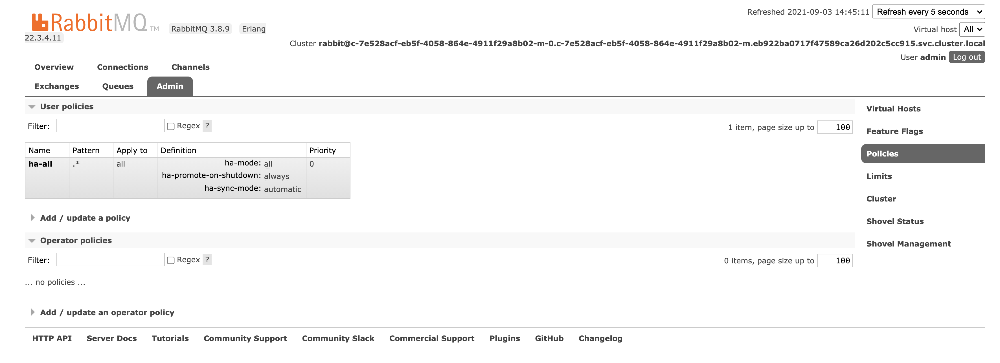

---

Copyright:
  years: 2018, 2019
lastupdated: "2019-03-28"

subcollection: messages-for-rabbitmq

---

{:new_window: target="_blank"}
{:shortdesc: .shortdesc}
{:screen: .screen}
{:codeblock: .codeblock}
{:pre: .pre}

# High-Availability and Performance
{: #high-availability}

{{site.data.keyword.messages-for-rabbitmq_full}} is a managed cloud messages service that is fully integrated into the {{site.data.keyword.cloud_notm}} ecosystem. The message broker, storage, and supporting infrastructure all run in {{site.data.keyword.cloud_notm}}.

{{site.data.keyword.messages-for-rabbitmq}} provides replication, fail-over, and high-availability features to protect your databases and data from infrastructure maintenance, upgrades, and failures. Deployments contain a cluster with three nodes where all three nodes are equal peers. 

The default virtual host is configured to mirror its queues across all nodes in the cluster to provide [high-availability](https://www.rabbitmq.com/ha.html). High-availability in RabbitMQ is set by [policy](https://www.rabbitmq.com/parameters.html#policies), and you can view the policy in the [RabbitMQ Management UI, the HTTPS API, or `rabbitmqadmin`](/docs/services/messages-for-rabbitmq?topic=messages-for-rabbitmq-management-plugin) when you log in with the [admin account](/docs/services/messages-for-rabbitmq?topic=messages-for-rabbitmq-user-mangement#the-admin-user).

You can modify high-availability by adding a policy and setting it with a higher priority, but the default policy cannot be removed. Any additional virtual hosts do not have a high-availability policy set by default.  It is recommended that you to add a high-availability policy to all your virtual hosts.

## Application-level High-Availability

Applications that communicate over networks and cloud services are subject to transient connection failures. You want to design your applications to retry connections when errors are caused by a temporary loss in connectivity to your deployment or to {{site.data.keyword.cloud_notm}}.

Because {{site.data.keyword.messages-for-rabbitmq}} is a managed service, regular updates and database maintenance occurs as part of normal operations. This can occasionally cause short intervals where your database is unavailable. 

Your applications have to be designed to handle temporary interruptions to the database, implement error handling for failed database commands, and implement retry logic to recover from a temporary interruption.

Several minutes of database unavailability or connection interruption is not expected. Open a [support ticket](https://cloud.ibm.com/unifiedsupport/cases/add) with details if you have time periods longer than a minute with no connectivity so we can investigate.

## Performance

{{site.data.keyword.messages-for-rabbitmq}} deployments can be [scaled to your usage](/docs/services/messages-for-rabbitmq?topic=messages-for-rabbitmq-dashboard-settings#scaling-resources), but they do not auto-scale. There are a few factors to consider if you are concerned about the performance of your deployment.

### Disk IOPS

The number of Input-Output Operations per second (IOPS) is limited by the type of storage volume being used. Storage volumes for {{site.data.keyword.messages-for-rabbitmq}} deployments are provisioned on [Block Storage Endurance Volumes in the 10 IOPS per GB tier](/docs/infrastructure/BlockStorage?topic=BlockStorage-About#provendurance). IOPS limits can affect RabbitMQ message throughput and storage operations, and hitting the limits can cause disk to fall behind on reclaiming space after messages are consumed, leading to publisher throttling until activity slows down. You can increase the number IOPS available to your deployment by increasing disk space.

### RabbitMQ Memory Alarms

By default, when the RabbitMQ server uses above 40% of the available RAM, it raises a memory alarm and blocks all connections that are publishing messages. Once the memory alarm has cleared normal service resumes. Note that this does not prevent the RabbitMQ server from using more than 40% of the allocated memory, it is merely the point at which publishers are throttled. More information about RabbitMQ memory usage can be found in the [RabbitMQ documentation](https://www.rabbitmq.com/memory.html). You can scale the amount of memory available to your deployment.

### Monitoring 

You can use the [monitoring integration](/docs/services/messages-for-rabbitmq?topic=messages-for-rabbitmq-monitoring), or you can [configure client notifications](https://www.rabbitmq.com/alarms.html) from RabbitMQ itself, to estimate typical resource usage, and scale your deployment accordingly.

If you are planning on running operations that might put a spike in the usual RAM usage, or an increase in IOPS, you can manually scale your service's resources up to avoid hitting limits that can affect deployment operations.

## SLA

{{site.data.keyword.messages-for-rabbitmq}} deployments conform to the {{site.data.keyword.cloud_notm}} [SLA terms](/docs/overview?topic=overview-SLAs#SLAs).

