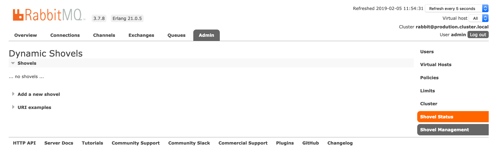

---
copyright:
  years: 2019
lastupdated: "2019-02-01"

keywords: rabbitmq, databases

subcollection: messages-for-rabbitmq

---

{:new_window: target="_blank"}
{:shortdesc: .shortdesc}
{:screen: .screen}
{:codeblock: .codeblock}
{:pre: .pre}
{:tip: .tip}

# Using RabbitMQ Plugins
{: #plugins}

RabbitMQ supports various plugins to extend its core functionality. {{site.data.keyword.messages-for-rabbitmq_full}} comes with a selection of plugins that are already enabled on your deployment. Plugin management is handled by the {{site.data.keyword.messages-for-rabbitmq}} service. Users can not enable or disable plugins.

## Shovel Plugin

{{site.data.keyword.messages-for-rabbitmq}} comes with the [Shovel Plugin](https://www.rabbitmq.com/shovel.html) and the [Shovel Management Plugin](https://github.com/rabbitmq/rabbitmq-shovel-management) enabled. You can configure the plugin through both the [RabbitMQ Management Plugin UI](/docs/services/messages-for-rabbitmq?topic=messages-for-rabbitmq-management-plugin) and its accompanying API.

The _Shovel Status_ and _Shovel Management_ links appear under the _Admin_ tab.

If you do not see the _Admin_ tab, you might need to log into the management UI with the [admin user](/docs/services/messages-for-rabbitmq?topic=messages-for-rabbitmq-admin-password). 
{: .tip}

In the RabbitMQ Management API, the Shovel Management Plugin adds endpoints for listing, creating, and deleting shovels. Usage and examples are in the [github repository's documentation](https://github.com/rabbitmq/rabbitmq-shovel-management#usage).

## Delayed Message Plugin

The [delayed message plugin](https://github.com/rabbitmq/rabbitmq-delayed-message-exchange) is a third-party plugin that adds delayed messaging and scheduled messaging to RabbitMQ. 

To use the plugin, declare an exchange with the type `x-delayed-type`. To delay a message, publish it with the `x-delay` header with the number of milliseconds the message should be delayed. More detailed usage information is in the [plugin's documentation](https://github.com/rabbitmq/rabbitmq-delayed-message-exchange#usage).

## STOMP Plugin

The [RabbitMQ STOMP Plugin](https://www.rabbitmq.com/stomp.html) provides support for sending [STOMP-formatted](http://stomp.github.io/) messages through RabbitMQ. The plugin exposes a port to handle STOMP traffic on your deployment, and it is TLS/SSL secured. The connection information for STOMP clients is in the `stomp_ssl` section of your deployment's [connection strings](/docs/services/messages-for-rabbitmq?topic=messages-for-rabbitmq-connection-strings#the-stomp_ssl-section).

## RabbitMQ Management Plugin

The Management Plugin provides access to your deployment through a web browser, `rabbitmqadmin` and through the RabbitMQ API. Information on using the Management Plugin to connect to your deployment in on the [Connecting with the RabbitMQ Management Plugin](/docs/services/messages-for-rabbitmq?topic=messages-for-rabbitmq-management-plugin) page.
