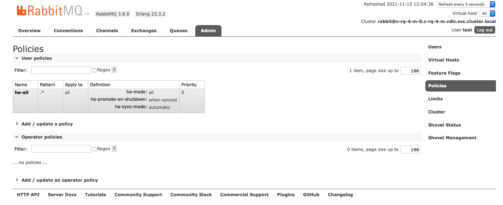

---

copyright:
  years: 2018, 2022
lastupdated: "2022-06-22"

keywords: rabbitmq, databases, ha, rabbitmq ha, rabbitmq high availability

subcollection: messages-for-rabbitmq

---

{:external: .external target="_blank"}
{:shortdesc: .shortdesc}
{:screen: .screen}
{:codeblock: .codeblock}
{:pre: .pre}

# High-Availability 
{: #high-availability}

{{site.data.keyword.messages-for-rabbitmq_full}} is a managed cloud messages service that is fully integrated into the {{site.data.keyword.cloud_notm}} environments. The message broker, storage, and supporting infrastructure all run in {{site.data.keyword.cloud_notm}}.

## RabbitMQ Cluster Configuration
{: #rabbitmq-cluster-config}

{{site.data.keyword.messages-for-rabbitmq}} provides replication, fail-over, and high-availability features to protect your databases and data from infrastructure maintenance, upgrades, and failures. Deployments contain a cluster with three nodes where users, virtual hosts, queues, exchanges, bindings, runtime parameters, and other distributed state are shared across all three nodes. If a node fails, the node is either deleted or restarted, and then it or a new node is resynced to the cluster. Your deployment remains available to process messages during the resync, although it is a memory intensive process. You can learn more about memory management concerns on the [Performance](/docs/messages-for-rabbitmq?topic=messages-for-rabbitmq-performance) page.

## High-Availability Queue Configuration
{: #high-availability-queue-config}

The default virtual host is configured to mirror its queues across all nodes in the cluster to provide [high-availability](https://www.rabbitmq.com/ha.html). High-availability in RabbitMQ is set by [policy](https://www.rabbitmq.com/parameters.html#policies), and you can view the policy in the [RabbitMQ Management UI, the HTTPS API, or `rabbitmqadmin`](/docs/messages-for-rabbitmq?topic=messages-for-rabbitmq-management-plugin) when you log in with the [admin account](/docs/messages-for-rabbitmq?topic=messages-for-rabbitmq-user-management#the-admin-user).

{: caption="Figure 1. RabbitMQ policies page" caption-side="bottom"}

You can modify high-availability by adding a policy and setting it with a higher priority, but the default policy cannot be removed. Any additional virtual hosts do not have a high-availability policy set by default.  It is recommended that you to add a high-availability policy to all your virtual hosts.

### Quorum Queues
{: #quorum-queues}

Starting in RabbitMQ 3.8, high-availability can be managed with [quorum queues](https://www.rabbitmq.com/quorum-queues.html). Using quorum queues can significantly improve high-availability of a deployment, specifically in cases where queues exist long-term and their durability is more important than other features. Quorum queues manage high-availability by maintaining a quorum that uses the Raft Consensus Algorithm, and the current primary and most of the replicas agree on the contents of the queue. If something happens to the primary node, the replicas elect the next primary.

The RabbitMQ documentation covers the [use-cases](https://www.rabbitmq.com/quorum-queues.html#use-cases), and how to [implement quorum queues in your cluster](https://www.rabbitmq.com/quorum-queues.html#usage).

For more information on quorum queues and the preferred status of RabbitMQ 3.8, review this [blog post announcement](https://cms.ibm.com/cloud/blog/announcements/ibm-cloud-messages-for-rabbitmq-38-is-now-preferred).  

### Mirrored Queues
{: #mirrored-queues}

While quorum queues are preferred, the default configuration in RabbitMQ 3.7 and prior uses [mirrored queues](https://www.rabbitmq.com/ha.html#what-is-mirroring). Mirrored queues are configured with each queue containing a primary located on one member of the cluster and mirrors of the queues exist on the other members of the cluster. Messages published to the queue first go to the primary and are then replicated to the mirrors. If something happens to the primary node, the oldest synchronized mirror is promoted to primary.

## High-Availability for your Application
{: #high-availability-app}

Applications that communicate over networks and cloud services are subject to transient connection failures. Also, because {{site.data.keyword.messages-for-rabbitmq}} is a managed service, regular updates and database maintenance occurs as part of normal operations. These operations can cause a short blip in connectivity, so you might also see a short connection interruption.

You want to design your applications to handle a temporary loss in connectivity to your deployment or to {{site.data.keyword.cloud_notm}}. 

The RabbitMQ documentation has an overview of what sorts of things you can do to help make your applications robust and stable in its [Production Checklist](https://www.rabbitmq.com/production-checklist.html#apps), under the _Applications_ section. It includes some general connection management and recovery advice.

RabbitMQ and RabbitMQ drivers support various features to help you design a resilient application.
- [Consumer Acknowledgments and Publisher Confirms](https://www.rabbitmq.com/confirms.html) - to ensure that messages are sent and received, and to catch and recover from situations where they are not. 
- [Heartbeats and TCP Keepalives](https://www.rabbitmq.com/heartbeats.html) - using heartbeat and keepalive parameters when your application connects can detect and prevent zombie connections.
- [Consumer Cancel Notifications](https://www.rabbitmq.com/consumer-cancel.html) - detect and handle instances where a consumer stops consuming from a queue.

{{site.data.keyword.messages-for-rabbitmq}} also comes with the [Shovel plug-in](https://www.rabbitmq.com/shovel.html). Shovels can handle connecting, reading and writing messages, and connection failure and republishing.

Several minutes of database unavailability or connection interruption are not expected. Open a [support ticket](https://cloud.ibm.com/unifiedsupport/cases/add) with details if you have time periods longer than a minute with no connectivity so we can investigate.

## {{site.data.keyword.messages-for-rabbitmq}} Connection Limits 
{: #rabbitmq-connection-limits}

At provision, {{site.data.keyword.messages-for-rabbitmq}} has 4 different endpoints and sets the maximum number of connections per node and for each endpoint as follows: 

* **HTTPS**: 1024 x 3 nodes = 3072
* **AMQPS**: 20000 x 3 nodes = 60000
* **MQTTS**: 20000 x 3 nodes = 60000
* **STOMPS**: 20000 x 3 nodes = 60000

If the number of connections to the database exceeds the connection limit, new connections fail and return an error.

## Monitoring for High-Availability
{: #monitoring-high-availability}

{{site.data.keyword.messages-for-rabbitmq}} has [{{site.data.keyword.la_full_notm}} integration](/docs/messages-for-rabbitmq?topic=cloud-databases-logging) so that you can view live and historical logs.

Checking your deployment's logs helps you monitor the state of HA and replication for your deployment. If you are having persistent issues with your applications, logs can also provide insight to what is happening on your databases when you are experiencing connection failures or other disruptions.

### RabbitMQ Reliability Guide
{: #rabbitmq-reliability-guide}

The RabbitMQ documentation provides an excellent [Reliability Guide](https://www.rabbitmq.com/reliability.html) that covers a wide-range of topics that are related to making sure that your cluster is functioning and your data is resilient. It also covers features that are available to you as a user to monitor the deployment, connections, queues, and messages to ensure smooth operations.

## High availability, disaster recovery, and SLA resources
{: #high-availability-disaster-sla}

{{site.data.keyword.messages-for-rabbitmq}} deployments conform to the {{site.data.keyword.cloud_notm}} Databases [HA, DR, and SLA](/docs/cloud-databases?topic=cloud-databases-ha-dr) terms.

